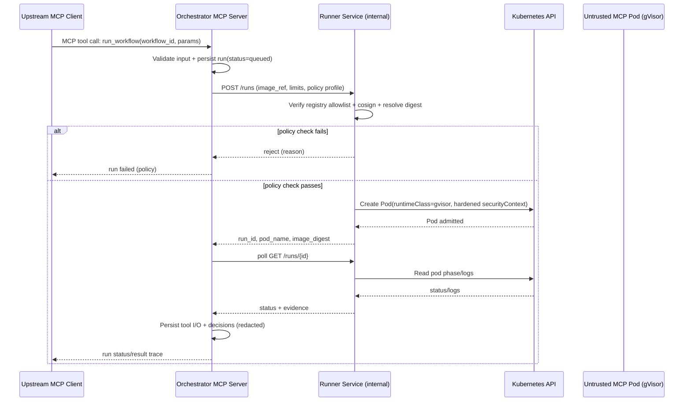

# Composed MCP Server MVP Architecture (Chunk 0)

## High-Level Components
- **Upstream MCP Client** (IDE/Loveable/etc.)
- **Orchestrator MCP Server (TypeScript/Node)**
  - exposes high-level tools (`run_workflow`, `get_run_trace`)
  - validates schemas, stores run/trace metadata
- **Runner Service (Go, internal HTTP)**
  - enforces image/security policy
  - launches sandboxed run pods in Kubernetes
- **Kubernetes Cluster**
  - run namespace for untrusted pods
  - gVisor RuntimeClass for isolation
  - deny-by-default egress network policy
- **Persistence**
  - SQLite (MVP) for orchestrator metadata/audit records
  - filesystem/PVC for artifacts (MVP)

## Sequence Diagram

## Trust Boundary Narrative
- **Trusted:** orchestrator, runner, cluster control-plane, policy config.
- **Untrusted:** downstream MCP server image, process, outputs, and artifacts until validated.
- **Controlled interface:** runner HTTP contract is the only path to launch execution.

## Security-by-Design Decisions
1. **Isolation-first:** untrusted code never runs in orchestrator/runner process space.
2. **Policy gate before execution:** signature + registry + digest checks happen before pod creation.
3. **Network minimization:** deny all egress unless explicitly required.
4. **Deterministic orchestration:** upstream tools remain stable while internal steps are controlled and audited.

## Deployment Model (MVP)
- Single Kubernetes cluster.
- Internal-only runner service (`ClusterIP`), no public ingress.
- Orchestrator can run in-cluster or local-dev with controlled access to runner.
